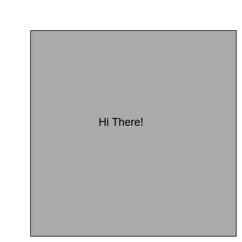

# Dein Feedback zur Schreibaufgabe zum Thema -subject- 

## 1. Vergleich der Kohäsion

Dieser Teil analysiert die Kohäsion von 2 gewählte Textes (Default sind Dokument 1 mit Document 2 welche Ihre Text und die musterlösung sind) auf 4 Hauptebenen:

LEXICAL_OVERLAP: CONTENT_OVERLAP: prüft, ob die verwendeten Wörter identisch sind oder nicht. Ein großer Wert des Attributs vet bedeutet, dass fast die gleichen Wörter verwendet werden
LEXICAL_OVERLAP: TOPIC_OVERLAP: besteht in der Überprüfung der Unterschiede der verwendeten Begriffe. Indem Sie zwei Textteile auswählen, können Sie überprüfen, ob sie die gleichen Begriffe verwenden.
LEXICAL_OVERLAP: ARGUMENT_OVERLAP: vergleicht, wie zwei Teile des Textes aufgebaut sind, insbesondere die Beziehungen zwischen Ihren Wörtern. Hier geht es um die Verben, Adjektive usw., die Sie zur Formulierung Ihrer Argumente verwenden
SEMANTIC: WORD2VEC(wiki): Die semantische Kohäsion vergleicht die  umfasst die Überprüfung der Domänen, zu denen die in einem Text verwendeten Wörter gehören. Wie groß der wert ist bestimmt ob die verwendete Begriffe zur derselben Domäne gehören. -subject- 

Die Folgende Tabelle vergleich deinen Dokument und deine Absätze mit der Musterlösung:
~~~{.graph1 path="" title="*Abbildung (2): Das Expertenmodell zum Thema -subject-*"}
~~~

Die Folgende Tabelle vergleich deinen Dokument und deine Absätze mit der Musterlösung1:

|  |
|:--:|
| *Abbildung (2): Das Expertenmodell zum Thema -subject-* |
